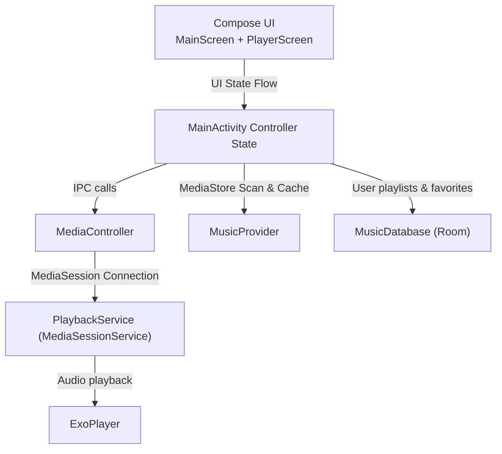

# Mixdio - Developer Documentation

> Architecture, package guidelines, implementation reference, and verification guidance for the Mixdio offline music player.

**Version:** 0.0.1 | **Last Updated:** 2026-07-06
**Scope:** Internal development, multi-module architecture, UI design system (M3EX), and audio playback synchronization.

---

## Table of Contents

- [Architecture Overview](#architecture-overview)
- [Project Structure](#project-structure)
- [Runtime Flow](#runtime-flow)
- [Core Concepts](#core-concepts)
- [Audio Playback Subsystem (Media3)](#audio-playback-subsystem-media3)
- [Room Database & JSON Caching](#room-database--json-caching)
- [UI & Design System (M3EX)](#ui--design-system-m3ex)
- [Build & Release Engineering](#build--release-engineering)
- [Security & Privacy Practices](#security--privacy-practices)
- [Verification Suite](#verification-suite)

---

## Architecture Overview

Mixdio is built on a **modular multi-module Android architecture** structured around clean MVVM design patterns, Android Media3 player session IPC boundary controls, Room databases, and custom Jetpack Compose design tokens.



### Key Architectural Decisions

| Decision | Rationale |
|----------|-----------|
| **Multi-Module Gradle Architecture** | Separates features (`:feature:player`), design systems (`:core:ui`), and data caching (`:core:storage`) to ensure clean dependencies. |
| **Media3 Session Binding** | Isolates background ExoPlayer playback in a separate foreground service bound via Media3 Session IPC, preventing app lifecycles from interrupting music. |
| **Dual-Cache Strategy** | Reads raw tracks rapidly via a cached local JSON payload (`mixdio_songs_cache.json`) while managing custom edits and playlists inside a Room SQL database. |
| **Material 3 Expressive (M3EX)** | Integrates fluid wavy progress indicators, dynamic variable font loading, and stacked shape-grouping to align with the expressive Android design system. |
| **Offline-Only Manifest** | Excludes the `android.permission.INTERNET` request entirely to guarantee data privacy. |

---

## Project Structure

Mixdio is organized into **4 Gradle modules** isolating the launcher, shared databases, standard UI tokens, and player user experiences:

```text
mixdio/
├── mixdio-app/
│   ├── app/                                     # App launcher, Hilt dependency composition
│   │   ├── src/main/java/dev/qtremors/mixdio/
│   │   │   ├── MixdioApp.kt                     # Hilt Application initialization
│   │   │   ├── MainActivity.kt                  # Entry activity, lifecycle player coordinator
│   │   │   └── player/
│   │   │       └── PlaybackService.kt           # Background Media3 Session Service
│   ├── core/
│   │   ├── storage/                             # Room databases, MediaStore syncing, JSON caching
│   │   │   └── src/main/java/dev/qtremors/mixdio/core/storage/
│   │   │       ├── Song.kt                      # Song schema
│   │   │       ├── Playlist.kt                  # Playlist schema (Room Entities)
│   │   │       ├── MusicDatabase.kt             # Room DB configuration
│   │   │       └── MusicProvider.kt             # MediaStore query provider
│   │   └── ui/                                  # Common design system tokens, themes, haptics
│   │       └── src/main/java/dev/qtremors/mixdio/core/ui/
│   │           ├── components/
│   │           │   ├── WavyProgress.kt          # Canvas-based progress bars
│   │           │   └── ExpressiveComponents.kt  # M3EX buttons and shape groups
│   │           └── theme/
│   │               ├── Color.kt                 # Accent colors
│   │               ├── Theme.kt                 # Theme builder (dynamic typography integration)
│   │               └── VariableFontFactory.kt   # Variable Google Sans Flex loader
│   │       └── src/main/res/font/
│   │           └── google_sans_flex_variable.ttf # Google Sans Flex variable font asset
│   └── feature/
│       └── player/                              # Tracks browsers, albums grid, full details screen
│           └── src/main/java/dev/qtremors/mixdio/feature/player/
│               ├── components/
│               │   └── SharedComponents.kt      # SongRowItems, MiniPlayer
│               └── screens/
│                   ├── MainScreen.kt            # Songs browser, playlist detail, folders list
│                   └── PlayerScreen.kt          # Playback detail viewer, repeat/shuffle, wavy progress
```

---

## Runtime Flow

1. **Service Startup & Controller Binding:** When `MainActivity` starts, it creates a Media3 `SessionToken` pointing to `PlaybackService` and instantiates a `MediaController` asynchronously.
2. **MediaStore Sync Check:** `MusicProvider` scans the device's MediaStore in a background dispatcher. If differences are detected against the local JSON cache, the JSON cache is updated.
3. **Database Preload:** Playlist definitions and favorites are preloaded from Room.
4. **UI Assembly:** Once the MediaController binds, the MainScreen loads, subscribing to the controller state flow (playing status, active track index, seek position).
5. **Foreground Service Promotion:** When music begins playing, `PlaybackService` promotes itself to a Foreground Service and attaches a system Media notification.

---

## Core Concepts

### Audio Playback Subsystem (Media3)

- **ExoPlayer:** Built-in Android player engine configured inside `PlaybackService`. Handles track buffering, gapless transition, repeat modes, and audio attributes.
- **Audio Focus Handling:** Configured to automatically duck or pause playback when other applications request focus (e.g., incoming phone calls, navigation alerts).
- **Session IPC:** UI updates and user commands (next, pause, seek) run through a `MediaController` proxy that transmits command payloads via Binder transactions.

### Room Database & JSON Caching

- **Room Cache Database (`mixdio-cache.db`):** 
  - `PlaylistEntity`: Stores custom playlist folders.
  - `PlaylistSongEntity`: Tracks associations between playlists and tracks.
  - `FavoriteOverrideEntity`: Stores favorites flags separate from transient MediaStore tags.
- **MediaStore Sync:** Queries Android's MediaStore provider for `.mp3`, `.wav`, `.m4a`, and other local audio assets.
- **JSON Serialization:** Track lists are serialized locally to `mixdio_songs_cache.json` in the app's cache folder for instant cold-starts.

---

## UI & Design System (M3EX)

### Variable Font Factory

Google Sans Flex variable font supports custom axis ranges (weight `100..1000`, width `50..150`, optical size `8..144`, roundness/ROND `0..100`). [VariableFontFactory.kt](file:///x:/Github/mixdio/mixdio-app/core/ui/src/main/java/dev/qtremors/mixdio/core/ui/theme/VariableFontFactory.kt) exposes preset styles:
- `EXPRESSIVE`: Optical size `32.0`, weight `600.0`, width `110.0`, roundness `30.0`
- `NEO`: Optical size `24.0`, weight `500.0`, width `100.0`, roundness `0.0`

### Morphing Headers

[MainScreen.kt](file:///x:/Github/mixdio/mixdio-app/feature/player/src/main/java/dev/qtremors/mixdio/feature/player/screens/MainScreen.kt) tracks the scroll offset of the tracks list. Using linear interpolation (`lerp`), the app bar's `"MIXDIO"` title morphs its font characteristics based on scroll depth:
- **Expanded (Scroll = 0):** Weight `950`, Width `85`, Roundness `100`
- **Collapsed (Scroll > 250):** Weight `600`, Width `110`, Roundness `30`

### Stacked Shape Groupings

List elements are grouped into cohesive visual card segments depending on their location in the list:
- `GroupPosition.Top`: Rounded top corners, sharp bottom corners (`RoundedCornerShape(topStart = 24.dp, topEnd = 24.dp, bottomStart = 8.dp, bottomEnd = 8.dp)`)
- `GroupPosition.Middle`: Uniform narrow corner shapes (`RoundedCornerShape(8.dp)`)
- `GroupPosition.Bottom`: Rounded bottom corners, sharp top corners (`RoundedCornerShape(topStart = 8.dp, topEnd = 8.dp, bottomStart = 24.dp, bottomEnd = 24.dp)`)
- `GroupPosition.Single`: Rounded on all corners (`RoundedCornerShape(24.dp)`)

---

## Build & Release Engineering

Mixdio separates debug builds from production builds using Gradle namespaces:
- **Debug Target:** Package `dev.qtremors.mixdio.debug`, displaying as `"Mixdio Debug"`.
- **Release Target:** Package `dev.qtremors.mixdio`, displaying as `"Mixdio"`.

To build the release binary, run:
```powershell
.\gradlew :app:assembleRelease
```

---

## Security & Privacy Practices

- **Zero-Network Architecture:** Mixdio does not request the `android.permission.INTERNET` permission in its manifest files. The code contains no trackers, telemetry trackers, analytic hooks, or external APIs.
- **Storage Scope:** Reads only media content via target SDK permissions; does not access files outside audio scopes.

---

## Verification Suite

Run full suite verification targets prior to committing code modifications:
```powershell
# Compile check and lint analysis
.\gradlew assembleDebug

# Run unit tests across all project modules
.\gradlew testDebugUnitTest
```
