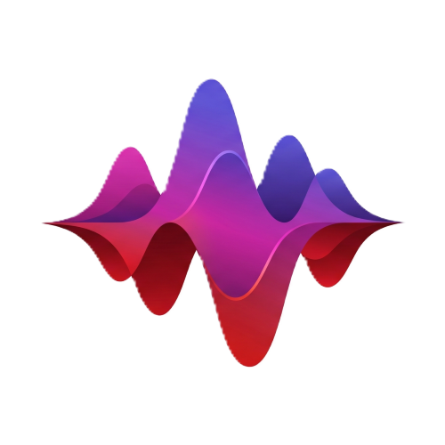

<p align="center">
  
</p>

<h1 align="center"><a href="https://qtremors.github.io/melatune/">Melatune</a></h1>

<p align="center">
  A Premium & Modern Offline Music Player for Android.
</p>

<p align="center">
  
  
  
  
  
</p>

> [!NOTE]
> **Privacy Model:** Melatune does not request the `android.permission.INTERNET` permission. All playback logs, favorites, and configuration metadata remain strictly on your local device.

---

## Why Melatune

Melatune is designed for audiophiles who want a beautiful, expressive music player without ads, trackers, telemetry, or network permissions. It synchronizes automatically with Android's MediaStore and caches tracks to provide a fast, responsive playback workspace.

---

## Features

| Feature | Description |
|---------|-------------|
| **True M3 Expressive (M3EX)** | Expressive shape groupings (top/middle/bottom rounded blend cards), dynamic typography axes, and fluid bouncy animation transitions. |
| **Scroll-Morphing Title** | The header `"MELATUNE"` dynamically morphs its font weight, width, and roundness in real-time based on the scroll position of the track browser. |
| **Floating Navigation Suite** | Uses a floating `HorizontalFloatingToolbar` pill with expanding/sliding `ShortNavigationBarItem` tab states. |
| **Wavy Progress indicators** | Smooth `LinearWavyProgressIndicator` and `CircularWavyProgressIndicator` that flow in response to active media states. |
| **Media3 ExoPlayer & Session** | Built on Android Media3 ExoPlayer for background playback, lock-screen notifications, and audio focus orchestration. |
| **Cache Database** | Persists custom user playlists, favorites, and track mapping metadata in a local Room database. |
| **Local JSON Scanner** | Fast local storage synchronizer scans and caches MediaStore audio listings in a compact JSON payload to prevent startup delay. |
| **Offline & Ad-Free** | No internet permission, no telemetry, no tracking, and no external dependencies. |

---

## Supported File Types

Melatune queries and synchronizes local audio storage, supporting all formats recognized by the device's ExoPlayer codecs.

| Category | Formats | Behavior |
|----------|---------|----------|
| **Standard Audio** | `.mp3`, `.wav`, `.m4a`, `.aac`, `.flac`, `.ogg`, `.opus` | Background playback, metadata extraction, volume control, track sorting, and library grouping. |

---

## Quick Start

Download the latest APK from [GitHub Releases](https://github.com/qtremors/melatune/releases) and install it on your Android device.

> **Runtime Permission:** Melatune requires Android 8.0 (API 26) or newer. Music files are scanned using local storage permissions. Notification permissions are requested on Android 13+ to support media controls.

### Build Commands

Run Gradle commands from `melatune-app/` (`gradlew.bat` may be used instead of `./gradlew` on Windows):

```bash
# Build the debug APK package
./gradlew :app:assembleDebug

# Run unit tests across all modules
./gradlew testDebugUnitTest

# Build signed, minified release APK
./gradlew :app:assembleRelease
```

Release outputs:
```text
app/build/outputs/apk/release/Melatune-0.0.1.apk
```

---

## Tech Stack

| Layer | Technology |
|-------|------------|
| **Language** | Kotlin 2.2.10 |
| **Android Gradle Plugin** | 9.2.1 |
| **UI** | Jetpack Compose BOM 2026.05.00, Material 3 1.5.0-alpha19 (M3 Expressive Suite) |
| **Architecture** | Modular multi-module MVVM (App, Storage, UI, Player Feature) with Hilt DI |
| **Media engine** | Android Media3 ExoPlayer, MediaSession background service |
| **Persistence** | Room cache database (`melatune-cache.db`), local JSON scan payload |
| **Image Loading** | Coil for Album Art resolution |

---

## Project Structure

```text
melatune/
├── melatune-app/
│   ├── app/                                     # App entry point, Hilt composition, and PlaybackService
│   │   ├── src/main/java/dev/qtremors/melatune/
│   │   │   ├── MelatuneApp.kt                     # Application initialization
│   │   │   ├── MainActivity.kt                  # App activity controller and navigation setup
│   │   │   └── player/
│   │   │       └── PlaybackService.kt           # Media3 Session playback service
│   ├── core/
│   │   ├── storage/                             # Room database, MediaStore queries, and entities
│   │   │   └── src/main/java/dev/qtremors/melatune/core/storage/
│   │   │       ├── Song.kt                      # Song schema
│   │   │       ├── Playlist.kt                  # Playlist schema
│   │   │       ├── MusicDatabase.kt             # Room caching configuration
│   │   │       └── MusicProvider.kt             # MediaStore query scanner
│   │   └── ui/                                  # Common UI tokens, themes, haptics, and fonts
│   │       └── src/main/java/dev/qtremors/melatune/core/ui/
│   │           ├── components/
│   │           │   ├── WavyProgress.kt          # Canvas-based progress bar
│   │           │   └── ExpressiveComponents.kt  # M3EX buttons and shape groups
│   │           └── theme/
│   │               ├── Theme.kt                 # Theme configuration
│   │               └── VariableFontFactory.kt   # Variable font axis configurations
│   └── feature/
│       └── player/                              # Playback details and browsers
│           └── src/main/java/dev/qtremors/melatune/feature/player/
│               ├── components/
│               │   └── SharedComponents.kt      # SongRowItems, MiniPlayer
│               └── screens/
│                   ├── MainScreen.kt            # Main screen (Songs, Playlists, etc.)
│                   └── PlayerScreen.kt          # Playback details screen
├── CHANGELOG.md                                 # Stable release changelog
├── DEVELOPMENT.md                               # Architecture & development guide
├── LICENSE.md                                   # Licensing terms
├── PRIVACY.md                                   # Privacy policy
├── TASKS.md                                     # Issues & Roadmap tracker
└── README.md                                    # Main entry point overview
```

---

## Documentation

| Document | Description |
|----------|-------------|
| [DEVELOPMENT.md](DEVELOPMENT.md) | Architecture, storage model, conventions, and maintenance notes |
| [CHANGELOG.md](CHANGELOG.md) | stable version history and release notes |
| [TASKS.md](TASKS.md) | Roadmap and planned features |
| [PRIVACY.md](PRIVACY.md) | Privacy policy |
| [LICENSE.md](LICENSE.md) | License terms |

---

## License

**Tremors Source License (TSL)** - source-available license allowing viewing, forking, and derivative works with **mandatory attribution**. Commercial use requires written permission.

See [LICENSE.md](LICENSE.md) for full terms.

---

<p align="center">
  Made by <a href="https://github.com/qtremors">Tremors</a>
</p>
